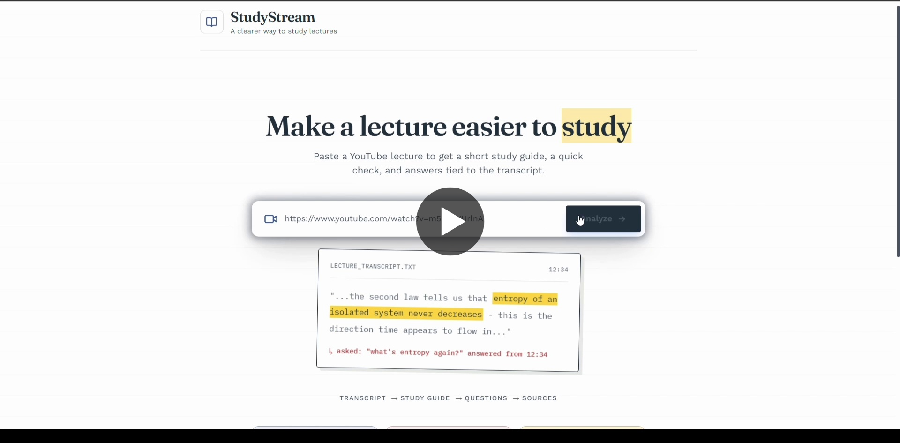

<div align="center">

# 🎓 StudyStream

**Turn lectures into searchable knowledge.**

StudyStream fetches available YouTube captions without downloading the video. It processes transcripts through a local RAG pipeline - chunking, embedding, and indexing - then answers questions using transcript-retrieved context and provides clickable timestamp citations to the retrieved source chunks. All powered by a Node.js-first architecture.

## Demo

[](video_demo/studystream_preview.mp4)

Click the preview to watch the demo video.

[](https://nodejs.org/)
[](https://reactjs.org/)
[](https://mistral.ai/)
[](https://huggingface.co/docs/transformers.js/index)
[](https://www.trychroma.com/)

</div>

---

## ⚡ What it does

Give StudyStream a YouTube link. It will:

1. **Extract**: Fetches available YouTube captions without downloading the video.
2. **Chunk**: Splits the text while preserving the `startTime` and `endTime` metadata.
3. **Embed** the chunks locally using HuggingFace's `all-MiniLM-L6-v2` directly inside Node.js (384-dimensional vectors).
4. **Index** the embeddings into ChromaDB.
5. **Summarize** the video (Title, Summary, Key Concepts, Takeaways).
6. **Generate a Quiz** (5 multiple-choice questions based on the video context).
7. **Answer your questions** using transcript-retrieved context - with clickable timestamp citations linking directly to the relevant lecture segment.

The interactive dashboard provides:

- **Real-time SSE processing** - a live pipeline view (Fetch → Chunk → Embed → Index → Summarize)
- **AI-generated summary** - title, paragraph summary, key concepts, and key takeaways
- **Interactive quiz** - one-question-at-a-time card flow with explanations and score tracking
- **AI Tutor** - a RAG-powered chat sidebar grounded in the transcript
- **Timestamp source cards** - every answer cites the exact transcript segments with links that jump to that position in the video
- **Latency observability** - per-query breakdown of embedding, retrieval, and LLM generation time

---

## 🗺️ Architecture Flow

```
                         STUDYSTREAM
                              │
                        YouTube URL
                              │
                              ▼
                    Node.js / Express
                              │
                       Create Job
                              │
                    ┌─────────┴─────────┐
                    │                   │
                    ▼                   ▼
              Get captions         Video metadata
                    │
                    ▼
             Timestamped text
                    │
                    ▼
                Chunking
                    │
             ┌──────┴──────┐
             │             │
             ▼             ▼
         Embeddings     Metadata
      Transformers.js   timestamps
             │             │
             └──────┬──────┘
                    ▼
                 ChromaDB
                    │
             User question
                    │
                    ▼
               Query embedding
                     │
                     ▼
                  ChromaDB
      (Filter: videoId = current video)
                     │
                     ▼
          Top-K Similarity Search
                     │
                     ▼
           Relevant transcript chunks
                    │
                    ▼
              Context builder
                    │
                    ▼
              Mistral API
                    │
             ┌──────┴───────┐
             ▼              ▼
          Answer         Sources
                            │
                            ▼
                     YouTube timestamp
```

**Independent Generation Tasks:**

```
Transcript
    ├──→ Summary
    ├──→ Key concepts
    └──→ Quiz
```

_Note the core distinction in RAG: **ChromaDB retrieves** the relevant chunks, while **Mistral generates** the final grounded answer. Timestamps in source citations come directly from chunk metadata - not from the LLM._

---

## 🛠️ Tech Stack

| Layer           | Tech                                                                                           |
| --------------- | ---------------------------------------------------------------------------------------------- |
| Application API | [Node.js](https://nodejs.org/) + [Express.js](https://expressjs.com/) (REST + SSE)             |
| Frontend        | [React](https://reactjs.org/) + [Vite](https://vitejs.dev/) + Tailwind CSS                     |
| Embeddings      | [@xenova/transformers](https://huggingface.co/docs/transformers.js) (`all-MiniLM-L6-v2` local) |
| Vector Store    | [ChromaDB](https://www.trychroma.com/) (`chromadb` npm)                                        |
| Transcription   | TranscriptAPI (Fetches available YouTube captions)                                             |
| LLM             | [Mistral AI](https://mistral.ai/) (Configurable via `LLM_MODEL` env var)                       |

---

## 📂 Project Structure

```
StudyStream/
├── frontend/                    # React SPA (Vite + Tailwind CSS)
│   ├── src/
│   │   ├── App.jsx              # State orchestrator - SSE, routing, history
│   │   ├── index.css            # Dark theme, glassmorphism utilities, animations
│   │   └── components/
│   │       ├── Header.jsx           # Logo + New Lecture button
│   │       ├── VideoInput.jsx       # URL input + localStorage history
│   │       ├── ProcessingPipeline.jsx # SSE progress dashboard with stage indicators
│   │       ├── SummarySection.jsx   # Title, summary, key concepts, takeaways
│   │       ├── QuizSection.jsx      # Card-based interactive quiz UI
│   │       ├── AITutor.jsx          # RAG chat sidebar + timestamp source cards
│   │       └── PerformanceMetrics.jsx # Collapsible latency tray per query
│   └── tailwind.config.js
├── server/                      # Node.js API
│   ├── src/
│   │   ├── controllers/         # Route logic (video, chat, summary, quiz)
│   │   ├── services/            # Core business logic
│   │   │   ├── transcription.service.js # TranscriptAPI client
│   │   │   ├── chunking.service.js      # preserve timestamps
│   │   │   ├── embedding.service.js     # Transformers.js
│   │   │   ├── rag.service.js           # Similarity + LLM orchestration
│   │   │   ├── llm.service.js           # Mistral API calls
│   │   │   └── job.service.js           # In-memory background job state
│   │   ├── clients/
│   │   │   └── chroma.client.js         # ChromaDB interface
│   │   ├── routes/              # Express routers
│   │   └── server.js            # Entry point
├── evaluation/                  # RAG accuracy testing
│   ├── evaluate.js
│   └── questions.json
└── README.md
```

---

## 🧠 Important Design Decisions

1. **Node.js-First Architecture**: The application backend is implemented entirely in Node.js. Transformers.js enables local embedding generation within the JavaScript runtime, eliminating the need for a separate Python inference service. ChromaDB can run locally or through Chroma Cloud, while every application-layer concern - transcription, chunking, embedding, RAG orchestration, and LLM calls - lives within a single Node.js service.
2. **Skipping Local Whisper**: For the MVP, the system uses available YouTube captions instead of downloading and transcribing the video locally, significantly reducing processing time and infrastructure requirements.
3. **Preserved Timestamps & Data Isolation**: Each transcript chunk is stored with its `videoId`. Retrieval filters by the current video, and the backend validates the returned metadata before passing chunks to the LLM. Clickable timestamps are returned directly from the metadata, bypassing LLM citation generation.
   ```json
   {
     "videoId": "sha256(normalized-youtube-url)",
     "chunkIndex": 17,
     "startTime": 742.3,
     "endTime": 768.1
   }
   ```
4. **Asynchronous Jobs & SSE**: Video processing can take time. Instead of blocking the HTTP request, the backend creates a job ID and streams progress back to the React frontend using Server-Sent Events (SSE).
5. **Latency Tracking**: Tracks component-level and end-to-end latency for embedding generation, vector retrieval, and LLM generation.
6. **In-Memory URL Cache**: A normalized YouTube URL is used as the key for a process-local `Map`, allowing repeated analyses to reuse the processed transcript, summary, quiz, and chunks while the server remains running.

---

## 🚀 Getting Started

### Prerequisites

- Node.js v18+
- ChromaDB locally via Docker, or a Chroma Cloud database
- A [Mistral AI API Key](https://console.mistral.ai/)
- A TranscriptAPI key

### 1. Backend Setup

```bash
cd StudyStream/server
npm install
```

Copy `.env.example` to `.env` and add your keys. For local ChromaDB, leave `CHROMA_API_KEY` empty and set `CHROMA_URL`; for Chroma Cloud, set `CHROMA_API_KEY`, `CHROMA_TENANT`, and `CHROMA_DATABASE`:

```env
PORT=5000
CHROMA_URL=http://localhost:8000 # local mode only
CHROMA_API_KEY=                 # Cloud mode only
CHROMA_TENANT=                  # Cloud mode only
CHROMA_DATABASE=StudyStream      # Cloud mode only
LLM_API_KEY=your_mistral_api_key
LLM_MODEL=open-mistral-nemo
TRANSCRIPT_API_KEY=your_transcript_api_key
CORS_ORIGIN=http://localhost:5173
RAG_DISTANCE_THRESHOLD=1.5
```

For a Vercel frontend and Render backend, set `VITE_API_BASE_URL` in Vercel to the deployed backend URL ending in `/api`, and set `CORS_ORIGIN` in Render to the deployed Vercel origin.

Start the server:

```bash
npm run dev
```

### 2. Frontend Setup

```bash
cd StudyStream/frontend
npm install
```

Start the frontend:

```bash
npm run dev
```

Open the provided `localhost` URL in your browser.

---

## 📊 RAG Evaluation

StudyStream includes a custom retrieval evaluation set containing 30 transcript-grounded questions.

Each question is embedded using the same local `all-MiniLM-L6-v2` embedding model used by the application. The evaluator checks whether a relevant transcript chunk appears within the top-K ChromaDB retrieval results.

| Metric   | Result |
| -------- | -----: |
| Recall@1 | 46.67% |
| Recall@3 | 66.67% |
| Recall@5 | 70.00% |

These results represent retrieval recall on the current 30-question evaluation set, rather than end-to-end answer accuracy.

To run the evaluation, use:

```bash
node evaluation/evaluate.js <videoId>
```

_(Requires ChromaDB to be running and a video to be processed/indexed first)._

### Evaluation Method

Each evaluation question contains:

- a natural-language question
- an expected concept
- an approximate transcript timestamp

The evaluator:

1. Generates an embedding for the question.
2. Performs a top-5 similarity search in ChromaDB.
3. Checks whether a retrieved chunk matches the expected concept.
4. Records whether the relevant chunk appeared in the top 1, 3, or 5 results.
5. Reports embedding and ChromaDB retrieval latency.

This provides a lightweight, reproducible retrieval benchmark for the current MVP.

---

## 🔮 Limitations & Future Extensions

- **Caption Dependency**: Videos without available captions are not currently supported. A future version could fall back to Whisper or a transcription API when YouTube captions are unavailable.
- **Character-based Chunking**: Chunks are split based on raw character count rather than semantic sentence or paragraph boundaries.
- **Ephemeral Job and Cache State**: Job status, processed video metadata, summaries, quizzes, and the normalized-URL `Map` cache are maintained in memory. This keeps the single-user MVP lightweight but means state is lost when the server restarts or a hosting instance is recycled.
- **Long-video generation window**: Transcript chunking covers the fetched transcript, but summary and quiz generation currently use only the first 100 transcript segments to stay within LLM token limits. Chat retrieval can still search indexed chunks from the full transcript.
- **Stateless Chat**: The current RAG pipeline is stateless. It does not inject previous conversation turns into the retrieval and generation context.
- **Uncalibrated Threshold**: The relevance distance threshold (`RAG_DISTANCE_THRESHOLD`) is a heuristic value and is not dynamically calibrated across different subjects.
- **Evaluation Scope**: The current evaluation measures retrieval recall using a 30-question custom dataset. End-to-end answer quality is not currently measured.
- **Reranking**: Adding a cross-encoder reranking stage after vector retrieval would improve precision for complex or ambiguous queries.
- **Hybrid Retrieval**: Combining semantic vector search with keyword/BM25 retrieval would improve recall for queries where exact terminology matters.
